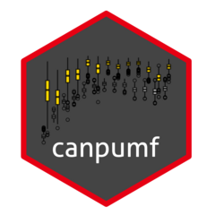

# canpumf <a href="https://mountainmath.github.io/canpumf/"></a>

<!-- badges: start -->
<!-- [](https://CRAN.R-project.org/package=canpumf) -->
[](https://github.com/mountainMath/canpumf/actions/workflows/R-CMD-check.yaml)
<!-- badges: end -->

The goal of **canpumf** is to facilitate ingesting, organizing, and working with StatCan PUMF data in R.

## Installation

You can install the current development version of canpumf from [GitHub](https://github.com/mountainMath/canpumf) with:

``` r
remotes::install_github("mountainmath/canpumf")
```

## Documentation
Please consult the [documentation and example articles](https://mountainmath.github.io/canpumf/) for further information.

StatCan publishes an [official guide to the Labour Force Survey](https://www150.statcan.gc.ca/n1/en/catalogue/71-543-G) for different vintages of the [LFS](https://www23.statcan.gc.ca/imdb/p2SV.pl?Function=getSurvey&SDDS=3701).

## Cache path

PUMF data can be large and should be cached locally. Set the `canpumf.cache_path` option to a local directory via `options(canpumf.cache_path="<your local path>")` in your `.Rprofile`. Without this, data is stored in `tempdir()` for the session only.

## DuckDB

On first use PUMF data is imported into DuckDB. By default a PUMF DuckDB connection will be shown in the RStudio (or Positron) Connections Pane once a connection is opened, you control the default behaviour by setting the `canpumf.register_connection` option in your .Rprofile:

```
options("canpumf.register_connection" = TRUE)
```

## Basic usage

Some PUMF data is available from StatCan via direct download and can be accessed directly via `get_pumf()`. In other cases, PUMF data must be ordered via EFT and deposited in the cache directory so `get_pumf()` can find it.

`get_pumf()` downloads (if needed), parses metadata, applies value labels automatically, and returns a lazy `dplyr::tbl()` backed by a local DuckDB database. Call `dplyr::collect()` to load into memory.

Column values are labeled automatically (e.g. province codes become factor levels like `"British Columbia"`). Column *names* remain as short coded names by default (e.g. `PROV`, `LFSSTAT`). To rename columns to human-readable variable labels, pipe through `label_pumf_columns()`:

```r
tbl <- get_pumf("LFS", "2022") |>
  label_pumf_columns()
```

When done querying, release the DuckDB connection with `close_pumf(tbl)`.

## LFS data

LFS data is organized by year, except for the current year where it is organized by month. To access data for a specific year:

```r
lfs_2022 <- get_pumf("LFS", "2022")
```

This downloads the 2022 LFS PUMF data if needed, parses it, loads labeled data into a shared DuckDB database, and returns a lazy tbl filtered to 2022. To access all LFS data currently in the local database:

```r
lfs_all_local <- get_pumf("LFS")
```

To ensure the local database contains all available LFS versions, use `refresh = "auto"`. This checks StatCan for versions not yet in the database and imports them:

```r
lfs_all <- get_pumf("LFS", refresh = "auto")
```

## Census data

The canpumf package supports Census PUMF from 1971 through 2021. All releases from 1991 onward are available via direct download; years 1986 and earlier must be ordered through Statistics Canada's EFT portal and placed in the cache directory.

```r
pumf_2021 <- get_pumf("Census", "2021")
```

By default the package loads the *individuals* file. Available variants by year:

| Years | Variants |
|---|---|
| 2021 | individuals, hierarchical |
| 2016 | individuals, hierarchical |
| 2011 | individuals (NHS), hierarchical (NHS) |
| 2006 | individuals, hierarchical |
| 2001 | individuals, households, families |
| 1996 | individuals, households, families |
| 1991 | individuals, households, families |
| 1986 | individuals, households |
| 1981 | individuals, households |
| 1976 | individuals |
| 1971 | individuals, individuals PR |

```r
pumf_h_2016 <- get_pumf("Census", "2016 (hierarchical)")
```

## Verified datasets

The following datasets have been end-to-end tested (metadata parsed, data imported, DuckDB built) without errors or warnings. Versions marked **direct download** can be fetched automatically by `get_pumf()`; others must be placed in the cache directory via Statistics Canada's EFT portal.

| Survey | Series | Verified versions | Direct download |
|---|---|---|:---:|
| Labour Force Survey | LFS | annual and monthly files | ✓ |
| Census of Population | Census | 2021 (individuals, hierarchical), 2016 (individuals, hierarchical), 2011 (individuals, hierarchical), 2006 (individuals, hierarchical), 2001 (individuals, households, families), 1996 (individuals, households, families), 1991 (individuals, households, families) | ✓ |
| Census of Population (EFT) | Census | 1986 (individuals, households, families), 1981 (individuals, households), 1976 (individuals, households, families), 1971 (individuals, households, families — prov and cma variants) | — |
| General Social Survey — Caregiving | GSS | Cycle 11 (1996), Cycle 21 (2007), Cycle 26 (2012), Cycle 32 (2018) | ✓ |
| General Social Survey — Aging and Social Support | GSS | Cycle 16 (2002) — MAIN + CG4 + CG6 + CR modules joinable on RECID | ✓ |
| General Social Survey — Safety | GSS | Cycle 8 (1993), Cycle 13 (1999), Cycle 28 (2014), Cycle 34 (2019) | ✓ |
| General Social Survey — Family | GSS | Cycle 10 (1995), Cycle 15 (2001), Cycle 25 (2011), Cycle 31 (2017) | ✓ |
| General Social Survey — Social Identity | GSS | Cycle 17 (2003), Cycle 27 (2013), Cycle 35 (2020) | ✓ |
| General Social Survey — Education | GSS | Cycle 9 (1994) | ✓ |
| General Social Survey — Time Use | GSS | Cycle 12 (1998), Cycle 24 (2010), Cycle 29 (2015), Cycle 36 (2022) — each Main + Episode modules joinable on PUMFID/RECID | ✓ |
| GSS Giving, Volunteering and Participating | SGVP | 1997, 2000, 2004, 2007, 2010, 2013, 2018, 2023 (1997–2010 add GS/VD/GIVE/VOLNTR detail modules joinable on PUMFID/MICRO_ID/IDNUM) | ✓ |
| Canadian COVID-19 Antibody and Health Survey | CCAHS | 1 | ✓ |
| International Travel Survey | ITS | 2018, 2019 | ✓ |
| Canadian Housing Survey | CHS | 2018, 2021, 2022 | ✓ |
| Survey of Financial Security | SFS | 1999, 2005, 2012, 2016, 2019, 2023 | ✓ |
| Canadian Perspectives Survey Series | CPSS | 1–6 | ✓ |
| Canadian Income Survey | CIS | 2017–2022 | ✓ |
| Survey of Household Spending | SHS | 2017 (Interview + Diary modules joinable on CASEID), 2019, 2021, 2023 | ✓ |

GSS surveys are keyed by their canonical `Cycle N (YYYY)` version (e.g.
`get_pumf("GSS", "Cycle 16 (2002)")`), since a bare year is not unique across
the GSS — several years carry both a regular cycle and a Giving/Volunteering
survey. For convenience the cycle number alone (`"Cycle 16"`, `"16"`), the bare
year (`"2002"`), and the historical theme name (`"Aging and Social Support"`,
`"Family 2017"`, `"Time Use 2022"`) all resolve to the canonical key.

CPSS and CCAHS are keyed by their bare cycle number (`get_pumf("CPSS", "1")`,
`get_pumf("CCAHS", "1")`). StatCan styles these cycles "Series N" (CPSS) and
"Cycle N" (CCAHS), so `"Series 3"`, `"Cycle 4"`, and `"CPSS 6"` resolve to the
number; CCAHS additionally accepts its reference year `"2022"`. A bare year is
*not* a CPSS alias, since several CPSS cycles share a calendar year.

## Related packages

The [**cansim** package](https://mountainmath.github.io/cansim/index.html) is designed to retrieve and work with public Statistics Canada data tables. **cansim** prepares retrieved data tables as analysis-ready tidy dataframes and provides a number of convenience tools and functions to make it easier to work with Statistics Canada data. It is available on CRAN and on [Github](https://github.com/mountainMath/cansim).

The [**cancensus** package](https://mountainmath.github.io/cancensus/index.html) is designed to retrieve and work with public Statistics Canada census data via the [CensusMapper API](https://censusmapper.ca/api). It is available on CRAN and on [Github](https://github.com/mountainMath/cancensus).


## Cite **canpumf**

If you wish to cite the `canpumf` package in your work:

  von Bergmann, J. (2026), canpumf: Import StatCan PUMF data into R. v0.5.2.

A BibTeX entry for LaTeX users is
```
  @Manual{,
    author = {Jens {von Bergmann}},
    title = {canpumf: Import StatCan PUMF data into R},
    year = {2026},
    note = {R package version 0.5.2},
    url = {https://mountainmath.github.io/canpumf/},
  }
```

### Statistics Canada Attribution

Subject to the Statistics Canada Open Data License Agreement, licensed products using Statistics Canada data should employ the following acknowledgement of source:

```
Acknowledgment of Source

(a) You shall include and maintain the following notice on all licensed rights of the Information:

  - Source: Statistics Canada, name of product, reference date. Reproduced and distributed on an "as is" basis with the permission of Statistics Canada.
 
(b) Where any Information is contained within a Value-added Product, you shall include on such Value-added Product the following notice:

  - Adapted from Statistics Canada, name of product, reference date. This does not constitute an endorsement by Statistics Canada of this product.
```
