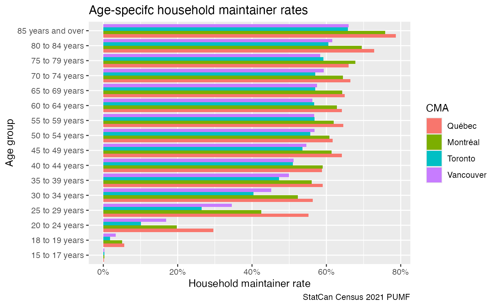
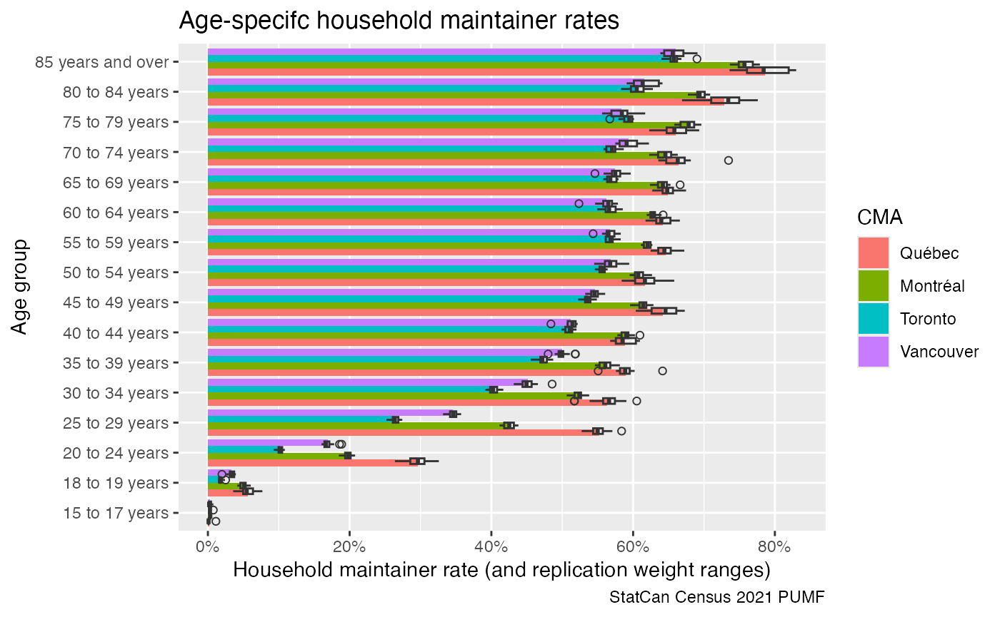
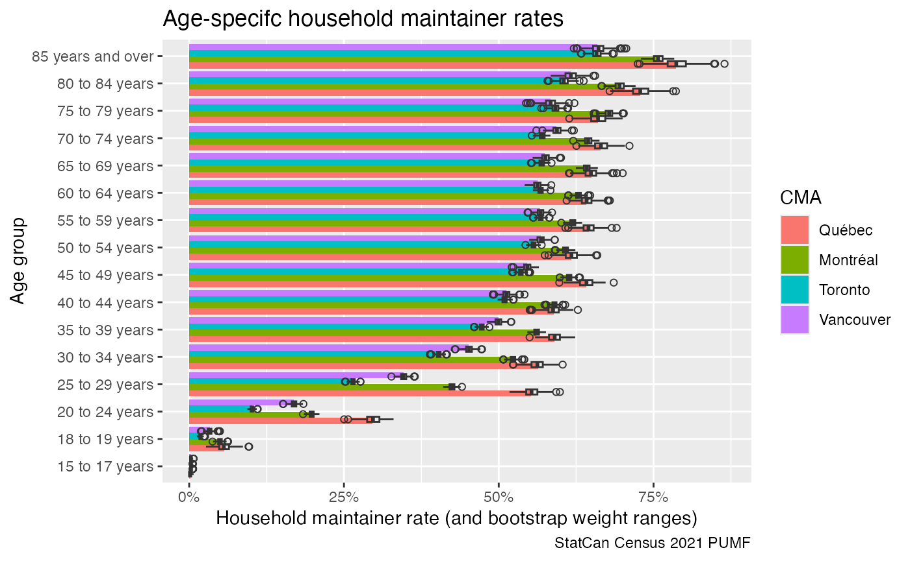

# Census

``` r

library(canpumf)
#> The duckplyr package is configured to fall back to dplyr when it encounters an
#> incompatibility. Fallback events can be collected and uploaded for analysis to
#> guide future development. By default, data will be collected but no data will
#> be uploaded.
#> ℹ Automatic fallback uploading is not controlled and therefore disabled, see
#>   `?duckplyr::fallback()`.
#> ✔ Number of reports ready for upload: 3.
#> → Review with `duckplyr::fallback_review()`, upload with
#>   `duckplyr::fallback_upload()`.
#> ℹ Configure automatic uploading with `duckplyr::fallback_config()`.
library(dplyr)
#> 
#> Attaching package: 'dplyr'
#> The following objects are masked from 'package:stats':
#> 
#>     filter, lag
#> The following objects are masked from 'package:base':
#> 
#>     intersect, setdiff, setequal, union
library(ggplot2)
options(canpumf.cache_path = Sys.getenv("COMPILE_VIG_CANPUMF"))
```

The package supports Census PUMF from 1971 through 2021, covering
individuals, hierarchical, households, and families variants depending
on the year. The 2021 and 2016 files are available via direct download;
older years must be ordered through Statistics Canada’s EFT portal and
placed in the directory pointed to by the `canpumf.cache_path` option.

``` r

census_2021 <- get_pumf("Census",version="2021") 
```

As a simple application we look at household maintainer rates by age
group for select metro areas, using standard weights.

``` r

census_2021 |>
  filter(CMA %in% c("Vancouver","Toronto","Montréal","Québec")) |>
  filter(PRIHM!="Not applicable") |>
  filter(AGEGRP!="Not available") |>
  summarise(across(matches("WEIGHT|WT\\d+"),sum),
            .by=c(CMA,AGEGRP,PRIHM)) |>
  mutate(Share=WEIGHT/sum(WEIGHT),.by=c(CMA,AGEGRP)) |>
  filter(PRIHM=="Person is primary maintainer") |>
  ggplot(aes(y=AGEGRP,x=Share,fill=CMA)) +
  geom_bar(stat="identity",position="dodge") +
  scale_x_continuous(labels=scales::percent) +
  labs(title="Age-specifc household maintainer rates",
       y="Age group",
       x="Household maintainer rate",
       caption="StatCan Census 2021 PUMF") 
#> Warning: Missing values are always removed in SQL aggregation functions.
#> Use `na.rm = TRUE` to silence this warning
#> This warning is displayed once every 8 hours.
```



Census PUMF data is quite rich and fairly accurate when slicing it
coarsely like this, but it’s always good to check for variability in the
data. Census PUMF (for the recent years) comes with 16 replication
weights, and we can look at the range they provide for the estimates.

``` r

census_2021 |>
  filter(CMA %in% c("Vancouver","Toronto","Montréal","Québec")) |>
  filter(PRIHM!="Not applicable") |>
  filter(AGEGRP!="Not available") |>
  summarise(across(matches("WEIGHT|WT\\d+"),sum),
            .by=c(CMA,AGEGRP,PRIHM)) |>
  collect() |>
  tidyr::pivot_longer(matches("WT\\d+"),names_to="Weights") |>
  mutate(Share=WEIGHT/sum(WEIGHT),
         Share_bsw=value/sum(value),
         .by=c(CMA,AGEGRP,Weights)) |>
  filter(PRIHM=="Person is primary maintainer") |>
  ggplot(aes(y=AGEGRP,fill=CMA)) +
  geom_bar(aes(x=Share),stat="identity",position="dodge") +
  geom_boxplot(aes(x=Share_bsw, group=interaction(CMA,AGEGRP)), fill=NA,shape=1, position="dodge") +
  scale_x_continuous(labels=scales::percent) +
  labs(title="Age-specifc household maintainer rates",
       y="Age group",
       x="Household maintainer rate (and replication weight ranges)",
       caption="StatCan Census 2021 PUMF") 
```



However, if we want a deeper understanding of the robustness of the
results we can add bootstrap weights, by default `add_bootstrap_weights`
weill add 500 bootstrap weights and save them to the database for later
reference.

``` r

census_2021 |>
  filter(CMA %in% c("Vancouver","Toronto","Montréal","Québec")) |>
  filter(PRIHM!="Not applicable") |>
  filter(AGEGRP!="Not available") |>
  add_bootstrap_weights("WEIGHT") |>
  summarise(across(matches("WEIGHT|WT\\d+|CPBSW\\d+"),sum),
            .by=c(CMA,AGEGRP,PRIHM)) |>
  collect() |>
  tidyr::pivot_longer(matches("CPBSW\\d+"),names_to="Weights") |>
  mutate(Share=WEIGHT/sum(WEIGHT),
         Share_bsw=value/sum(value),
         .by=c(CMA,AGEGRP,Weights)) |>
  filter(PRIHM=="Person is primary maintainer") |>
  ggplot(aes(y=AGEGRP,fill=CMA)) +
  geom_bar(aes(x=Share),stat="identity",position="dodge") +
  geom_boxplot(aes(x=Share_bsw, group=interaction(CMA,AGEGRP)), fill=NA,shape=1, position="dodge") +
  scale_x_continuous(labels=scales::percent) +
  labs(title="Age-specifc household maintainer rates",
       y="Age group",
       x="Household maintainer rate (and bootstrap weight ranges)",
       caption="StatCan Census 2021 PUMF") 
```



``` r

census_2021 |> close_pumf()
```
