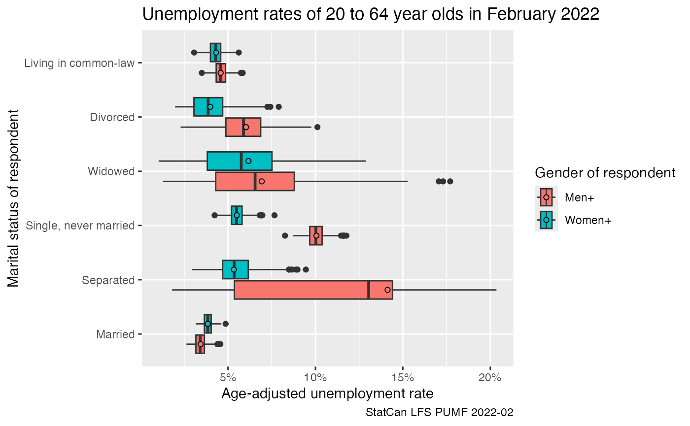
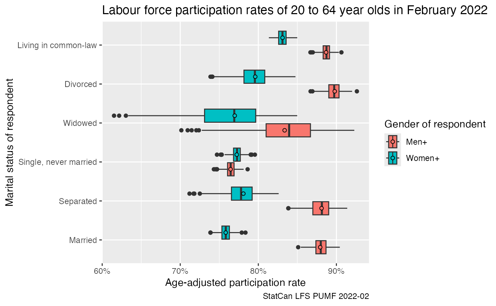
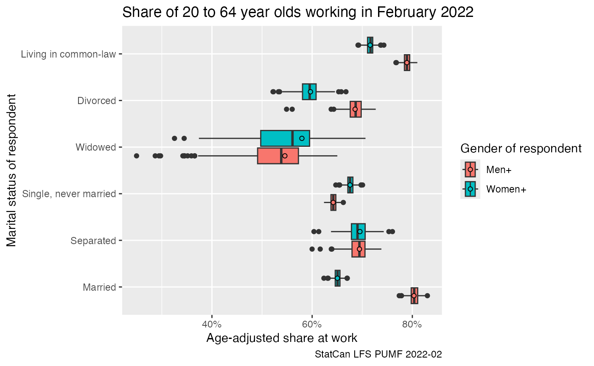
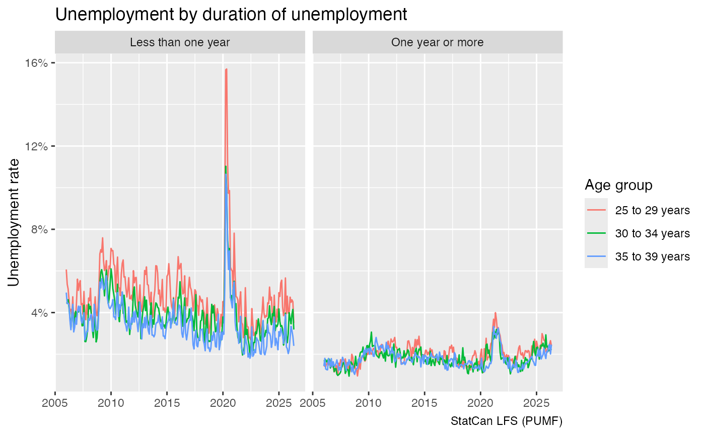
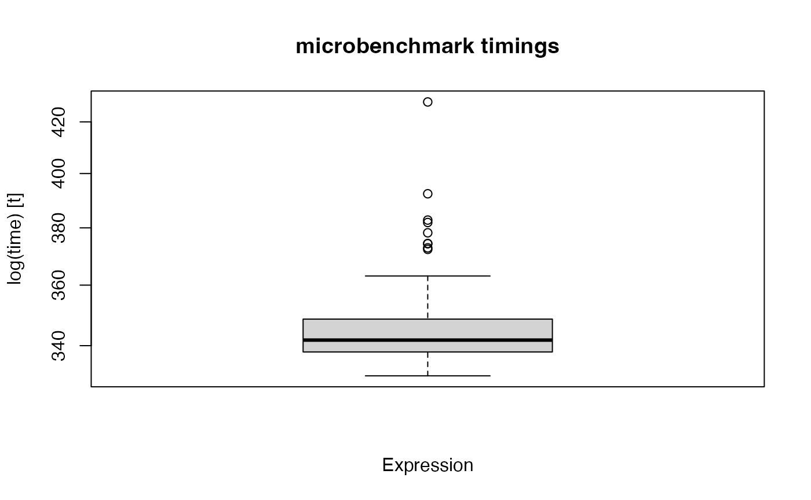
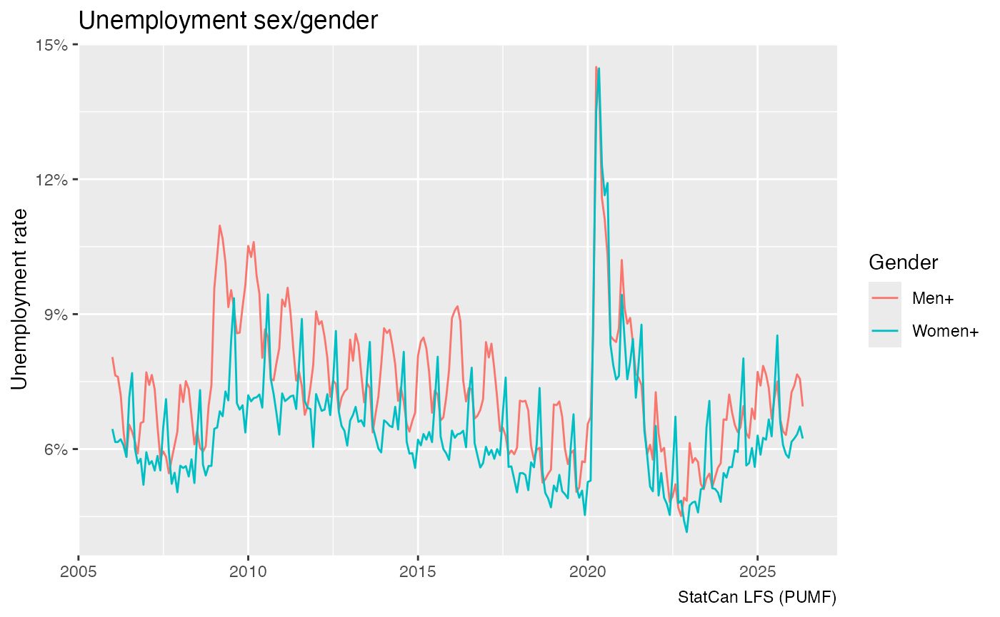

# LFS

``` r

library(dplyr)
#> 
#> Attaching package: 'dplyr'
#> The following objects are masked from 'package:stats':
#> 
#>     filter, lag
#> The following objects are masked from 'package:base':
#> 
#>     intersect, setdiff, setequal, union
library(tidyr)
library(ggplot2)
library(canpumf)
#> The duckplyr package is configured to fall back to dplyr when it encounters an
#> incompatibility. Fallback events can be collected and uploaded for analysis to
#> guide future development. By default, data will be collected but no data will
#> be uploaded.
#> ℹ Automatic fallback uploading is not controlled and therefore disabled, see
#>   `?duckplyr::fallback()`.
#> ✔ Number of reports ready for upload: 3.
#> → Review with `duckplyr::fallback_review()`, upload with
#>   `duckplyr::fallback_upload()`.
#> ℹ Configure automatic uploading with `duckplyr::fallback_config()`.
options(canpumf.cache_path = Sys.getenv("COMPILE_VIG_CANPUMF"))
```

The LFS is one of the most-used PUMF series, since January 2021 the LFS
PUMF is now easily available for direct download instead of needing to
request it via EFT. This makes it very easy to integrate the LFS into
reproducible workflows.

The `canpumf` package has two functions to facilitate access to the LFS
PUMF. The first lists all LFS pumf versions that are available for
direct download.

``` r

list_canpumf_collection() |> 
  filter(Acronym=="LFS")
#> # A tibble: 90 × 5
#>    Title               Acronym Version `Survey Number` url                      
#>    <chr>               <chr>   <chr>   <chr>           <chr>                    
#>  1 Labour Force Survey LFS     2026-05 3701            https://www150.statcan.g…
#>  2 Labour Force Survey LFS     2026-04 3701            https://www150.statcan.g…
#>  3 Labour Force Survey LFS     2026-03 3701            https://www150.statcan.g…
#>  4 Labour Force Survey LFS     2026-02 3701            https://www150.statcan.g…
#>  5 Labour Force Survey LFS     2026-01 3701            https://www150.statcan.g…
#>  6 Labour Force Survey LFS     2025    3701            https://www150.statcan.g…
#>  7 Labour Force Survey LFS     2024    3701            https://www150.statcan.g…
#>  8 Labour Force Survey LFS     2023    3701            https://www150.statcan.g…
#>  9 Labour Force Survey LFS     2022    3701            https://www150.statcan.g…
#> 10 Labour Force Survey LFS     2021    3701            https://www150.statcan.g…
#> # ℹ 80 more rows
```

The second one fetches and loads the LFS data. For example, to download
the LFS pumf for 2022 we use

``` r

lfs_2022 <- get_pumf("LFS","2022")

lfs_2022 |>
  select(1:5) |>
  head(10)
#> # Source:   SQL [?? x 5]
#> # Database: DuckDB 1.5.2 [root@Darwin 25.5.0:R 4.5.2//Users/jens/data/pumf.data/LFS/LFS.duckdb]
#>    REC_NUM SURVYEAR SURVMNTH LFSSTAT                    PROV            
#>      <int>    <int>    <int> <fct>                      <fct>           
#>  1       1     2022        1 Not in labour force        Quebec          
#>  2       2     2022        1 Employed, at work          British Columbia
#>  3       3     2022        1 Employed, at work          British Columbia
#>  4       4     2022        1 Employed, at work          Nova Scotia     
#>  5       5     2022        1 Not in labour force        British Columbia
#>  6       6     2022        1 Unemployed                 Manitoba        
#>  7       7     2022        1 Not in labour force        Manitoba        
#>  8       8     2022        1 Employed, at work          Alberta         
#>  9       9     2022        1 Employed, absent from work Ontario         
#> 10      10     2022        1 Employed, at work          Quebec
```

By default the data is stored in the temporary session path, generally
we want to make sure that the `canpumf.cache_path` option is set to a
path to permanently cache the data.

Values come labelled, but columns are not. People working regularly with
the LFS data will likely want to keep the short default column names,
they can be converted to human readable column lables using
`label_pumf_columns` function.

``` r

lfs_2022 <- lfs_2022 |> label_pumf_columns()
```

With this we can do some simple descriptive analysis. We could use the
`add_bootstrap_weights` function to add bootstrap weights if desired. We
focus in on February 2022 and add boodstrap weights. By default this
only adds 16 weights, for more serious applications we would want to add
more weights.

``` r

lfs_2022_02_data <- lfs_2022 |> 
  filter(`Survey month`==2) |>
  collect() |>
  add_bootstrap_weights(weight_col = "Standard final weight", seed = 42)
```

For this vignette we look at gender-specific labour fource status
statistics for the 20 to 64 year old population, computing age-adjusted
rates to even out age-specific effects.

``` r

data <- lfs_2022_02_data %>%
  filter(substr(`Five-year age group of respondent`,0,2) %in% seq(20,60,5)) %>%
  filter(`Labour force status`!="Not in labour force") %>%
  group_by(`Labour force status`,`Five-year age group of respondent`,`Gender of respondent`,
           `Marital status of respondent`) %>%
  summarise(across(matches("Standard final weight|BSW\\d+"),sum),.groups="drop") %>%
  pivot_longer(matches("Standard final weight|BSW\\d+"),names_to="Weight",values_to="Count") %>%
  group_by(`Five-year age group of respondent`,`Gender of respondent`,
           `Marital status of respondent`, Weight) %>%
  mutate(Share=ifelse(Count==0,0,Count/sum(Count))) %>%
  ungroup()

data_age_adjusted <- data %>%
  left_join((.) %>% 
              group_by(`Five-year age group of respondent`,`Gender of respondent`,Weight) %>%
              summarize(Count=sum(Count),.groups="drop") %>%
              group_by(`Gender of respondent`,Weight) %>%
              mutate(P_age__gender=Count/sum(Count)) %>%
              ungroup() %>%
              select(`Gender of respondent`,`Five-year age group of respondent`,Weight,P_age__gender),
            by=c("Gender of respondent","Five-year age group of respondent","Weight")) %>%
  group_by(`Gender of respondent`,`Labour force status`,`Marital status of respondent`, Weight) %>%
  summarise(age_adjusted=sum(Share*P_age__gender),.groups="drop")
  
data_age_adjusted %>%
  filter(`Labour force status`=="Unemployed") %>%
ggplot(aes(x=age_adjusted, y=`Marital status of respondent`, fill=`Gender of respondent`)) +
  geom_boxplot() +
  geom_point(shape=21,data=~filter(.,Weight=="Standard final weight"),position=position_dodge(width=0.75)) +
  scale_x_continuous(labels=scales::percent) +
  labs(title="Unemployment rates of 20 to 64 year olds in February 2022",
       x="Age-adjusted unemployment rate",
       caption="StatCan LFS PUMF 2022-02")
```



``` r

data2 <- lfs_2022_02_data %>%
  filter(substr(`Five-year age group of respondent`,0,2) %in% seq(20,60,5)) %>%
  group_by(`Labour force status`,`Five-year age group of respondent`,`Gender of respondent`,
           `Marital status of respondent`) %>%
  summarise(across(matches("Standard final weight|BSW\\d+"),sum),.groups="drop") %>%
  pivot_longer(matches("Standard final weight|BSW\\d+"),names_to="Weight",values_to="Count") %>%
  group_by(`Five-year age group of respondent`,`Gender of respondent`,
           `Marital status of respondent`, Weight) %>%
  mutate(Share=ifelse(Count==0,0,Count/sum(Count))) %>%
  ungroup()

data_age_adjusted2 <- data2 %>%
  left_join((.) %>% 
              group_by(`Five-year age group of respondent`,`Gender of respondent`,Weight) %>%
              summarize(Count=sum(Count),.groups="drop") %>%
              group_by(`Gender of respondent`,Weight) %>%
              mutate(P_age__sex=Count/sum(Count)) %>%
              ungroup() %>%
              select(`Gender of respondent`,`Five-year age group of respondent`,Weight,P_age__sex),
            by=c("Gender of respondent","Five-year age group of respondent","Weight")) %>%
  group_by(`Gender of respondent`,`Labour force status`,`Marital status of respondent`, Weight) %>%
  summarise(age_adjusted=sum(Share*P_age__sex),.groups="drop")
  
data_age_adjusted2 %>%
  filter(`Labour force status`=="Not in labour force") %>%
ggplot(aes(x=1-age_adjusted, y=`Marital status of respondent`, fill=`Gender of respondent`)) +
  geom_boxplot() +
  geom_point(shape=21,data=~filter(.,Weight=="Standard final weight"),position=position_dodge(width=0.75)) +
  scale_x_continuous(labels=scales::percent) +
  labs(title="Labour force participation rates of 20 to 64 year olds in February 2022",
       x="Age-adjusted participation rate",
       caption="StatCan LFS PUMF 2022-02")
```



``` r

data_age_adjusted2 %>%
  filter(`Labour force status`=="Employed, at work") %>%
ggplot(aes(x=age_adjusted, y=`Marital status of respondent`, fill=`Gender of respondent`)) +
  geom_boxplot() +
  geom_point(shape=21,data=~filter(.,Weight=="Standard final weight"),position=position_dodge(width=0.75)) +
  scale_x_continuous(labels=scales::percent) +
  labs(title="Share of 20 to 64 year olds working in February 2022",
       x="Age-adjusted share at work",
       caption="StatCan LFS PUMF 2022-02")
```



It’s good practice to close the database connection after being done
with a specific task.

``` r

lfs_2022 |> close_pumf()
```

Derived connections, like the one to the Februrary 2022 table, will
automatically be closed too.

## Timelines

LFS data can also easliy be accessed across time.

``` r

lfs_pumf <- get_pumf("LFS", refresh="auto")
```

We can now easily extract time series data, we want to perform as many
operations as possible at the database level. Before plotting we could
call `collect`, but this does not need to be done explicitly.

``` r

unemployment_stats <- lfs_pumf |> 
  filter(LFSSTAT !="Not in labour force") |>
  filter(AGE_12 %in% c("25 to 29 years","30 to 34 years", "35 to 39 years")) |>
  mutate(jd=case_when(is.na(DURJLESS) ~ "Not applicable",
                      DURJLESS<12 ~ "Less than one year",
                      TRUE ~ "One year or more")) |>
  mutate(Date=as.Date(paste0(SURVYEAR,"-",SURVMNTH,"-01"))) |>
  summarize(Count=sum(FINALWT),.by=c(Date,jd,AGE_12)) |>
  mutate(Share=Count/sum(Count),.by=c(Date,AGE_12)) |>
  filter(jd!="Not applicable")


unemployment_stats |>
  ggplot(aes(x=Date,y=Share,colour=AGE_12)) +
  geom_line() +
  facet_wrap(~jd) +
  scale_y_continuous(labels=scales::percent_format()) +
  labs(title="Unemployment by duration of unemployment",
       y="Unemployment rate",x=NULL,
       colour="Age group",
       caption="StatCan LFS (PUMF)")
#> Warning: Missing values are always removed in SQL aggregation functions.
#> Use `na.rm = TRUE` to silence this warning
#> This warning is displayed once every 8 hours.
```



Because the data is efficiently ogranzied in DuckDB, this query runs
quite fast despite no explicit indexing of the database, taking less
than half a second.

``` r

microbenchmark::microbenchmark(collect(unemployment_stats)) |> 
  boxplot()
#> Warning in microbenchmark::microbenchmark(collect(unemployment_stats)): less
#> accurate nanosecond times to avoid potential integer overflows
```



The SEX variable has been recategorized into the GENDER concept starting
in 2011, older LFS PUMF data still uses SEX. We can harmonize this by
coalescing the values.

``` r

lfs_pumf |> 
  filter(LFSSTAT !="Not in labour force") |>
  mutate(GENDER_SEX=coalesce(GENDER,SEX)) |>
  mutate(GENDER_SEX=case_when(GENDER_SEX=="Female"~"Women+",
                              GENDER_SEX=="Male"~"Men+",
                              TRUE ~ GENDER_SEX)) |>
  mutate(Date=as.Date(paste0(SURVYEAR,"-",SURVMNTH,"-01"))) |>
  summarise(Count=sum(FINALWT),.by=c(Date,LFSSTAT,GENDER_SEX)) |>
  mutate(Share=Count/sum(Count),.by=c(Date,GENDER_SEX)) |>
  filter(LFSSTAT=="Unemployed") |>
  ggplot(aes(x=Date,y=Share,colour=GENDER_SEX)) +
  geom_line() +
  scale_y_continuous(labels=scales::percent_format()) +
  labs(title="Unemployment sex/gender",
       y="Unemployment rate",x=NULL,
       colour="Gender",
       caption="StatCan LFS (PUMF)")
```



``` r

lfs_pumf |> close_pumf()
```
